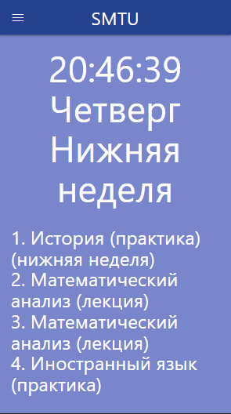
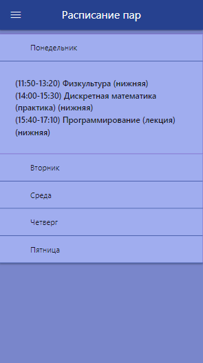
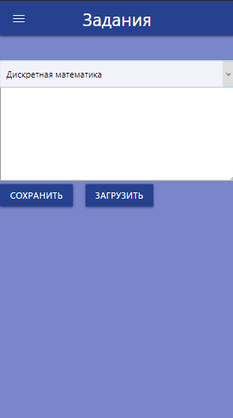
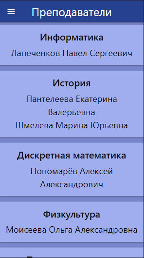

# smtu-app

## Простое приложение для быстрого доступа к информации университета

[Сайт на GithubPages](https://andreymokriev.github.io/smtu-app/)

## Список возможностей:

* Расписание на день
* Общее расписание
* Быстрый доступ к открытию ИСУ и Sakai
* Блокнот для домашнего задания
* Учебная литература
* Контакты
* Преподаватели

## Скриншоты

